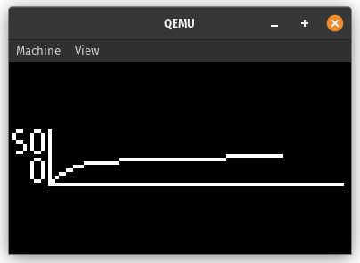
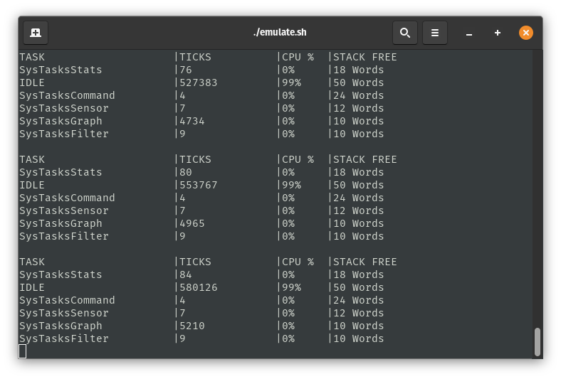

# Sistema de medicion de temperatura con filtro pasa bajos sobre sistema operativo de tiempo real

Aplicación de un sistema operativo de tiempo real en un sistema embebido. Simulación de un sistema de control de temperatura con un filtro pasa bajos. Comunicación UART con una computadora para visualizar el estado del sistema y cambiar el coeficiente de filtrado.

El sistema embebido utilizado es un microcontrolador *Stellaris LM3S811*. El sistema operativo utilizado es FreeRTOS. El sistema fue testeado a través de la herramienta de simulación QEMU. No se realizó el port a la placa real.

### Autores:
- **Bottini, Franco Nicolas**

### ¿ Como Clonar ?

Para compilar el proyecto, una vez clonado el repositorio, basta con ejecutar el comando `make` en la carpeta raíz del proyecto.

```bash
$ git clone https://github.com/francobottini99/SIS-TEMPRTOS-2024.git
$ cd SIS-TEMPRTOS-2024
$ make
```

## Resumen

El sistema embebido cuenta con cinco tareas: una tarea de lectura de temperatura, una tarea de filtrado de temperatura, una tarea que se encarga de graficar la temperatura, una tarea que se encarga de mostrar el estado del sistema y una tarea que se encarga de recibir comandos por UART.

La comunicación entre las tareas de lectura y filtrado de temperatura, y las tareas de filtrado y grafica de temperatura se realiza a través de colas de mensajes.

Se ajusto la prioridad de las tareas de manera tal que la tarea de lectura de temperatura tenga la mayor prioridad, seguida por la tarea de filtrado de temperatura, la tarea de graficado de temperatura, la tarea de visualización de estado y por último la tarea de recepción de comandos por UART.

Finalmente se asigno un *stack* a cada tarea de acuerdo a la cantidad de memoria que se estima que va a utilizar cada una, sumado a un margen de seguridad.

## Ejecución

Para ejecutar el programa utilizando QEMU, se suministra un script de ejecución `emulate.sh`.

```bash
$ ./emulate.sh
```

Si se desea modificar el coeficiente de filtrado por defecto con el que se ejecuta el programa, se puede ejecutar el script con el valor deseado como argumento.

```bash
$ ./emulate.sh 15 # Coeficiente de filtrado = 15
```

> [!WARNING]
> El coficiente de filtrado debe ser un número entero mayor que 0. Por defecto, el coeficiente de filtrado es 5. Si se ingresa un valor no válido, se utilizará el valor por defecto.

> [!NOTE]
> Se necesita tener instalado QEMU para poder ejecutar el script.

## Visualización

Al ejecutar el programa, se abrirá una ventana de QEMU con la simulación del sistema embebido. En la ventana de QEMU se puede visualizar el gráfico resultante del proceso de simulación y filtrado de la temperatura.

<p align="center">
  
</p>

Además, se va imprimiendo en la terminal el estado del sistema. Se puede visualizar la carga de CPU, el *stack* disponible y el número de *ticks* ocupados por el cada tarea en ejecución.

<p align="center">
  
</p>

> [!NOTE]
> La frecuencia de trabajo del sensor de temperatura simulado es de 10 Hz. Mientras que la información se muestra en la terminal a una frecuencia de 0.5 Hz.
